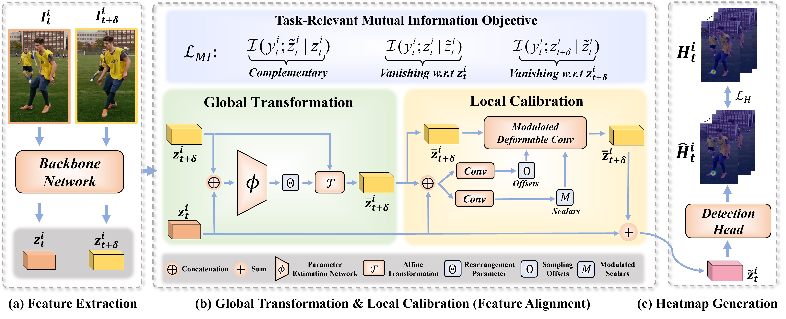

# Temporal Feature Alignment and Mutual Information Maximization for Video-Based Human Pose Estimation (CVPR2022)
&ensp; Multi-frame human pose estimation has long been a compelling and fundamental problem in computer vision. This task is challenging due to fast motion and pose occlusion that frequently occur in videos. State-of-the-art methods strive to incorporate additional visual evidences from neighboring frames (supporting frames) to facilitate the pose estimation of the current frame (key frame). One aspect that has been obviated so far, is the fact that current methods directly aggregate unaligned contexts across frames. The spatial-misalignment between pose features of the current frame and neighboring frames might lead to unsatisfactory results. More importantly, existing approaches build upon the straightforward pose estimation loss, which unfortunately cannot constrain the network to fully leverage useful information from neighboring frames.

&ensp; To tackle these problems, we present a novel hierarchical alignment framework, which leverages coarse-to-fine deformations to progressively update a neighboring frame to align with the current frame at the feature level. We further propose to explicitly supervise the knowledge extraction from neighboring frames, guaranteeing that useful complementary cues are extracted. To achieve this goal, we theoretically analyzed the mutual information between the frames and arrived at a loss that maximizes the taskrelevant mutual information. These allow us to rank No.1 in the Multi-frame Person Pose Estimation Challenge on large-scale benchmark datasets PoseTrack2017 and PoseTrack2018, and obtain state-of-the-art performance on benchmark Sub-JHMDB.

---
## Installation

Please check the guide of [DCPose](https://github.com/Pose-Group/DCPose) to run the code. There are a few caveats:

- Updated `DcPose_supp_files` can be downloaded [here](https://drive.google.com/file/d/1SnMxpdcMKXDE442jZGt4Dfb6ah5AS_hM/view?usp=sharing).
- Deformable Convolution have been implemented in `Pytorch1.8`.

- Note that **pre-train models** are not available, so you have to train the model from scratch.

